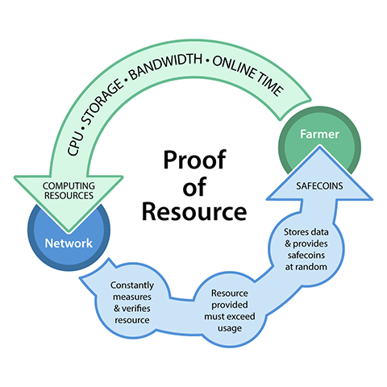

# Resourcennachweis

Resourcennachweis erlaubt dem Netzwerk Aktionen oder Services mit Hilfe von mathematisch verfizierbaren Mechanismen zu validieren.

Dieser Prozess misst die Fähigkeit eines Vaults Datenteile zu empfangen und zu speichern. Das hängt von den folgenden Computer Kriterien ab:

* CPU Geschwindigkeit
* Bandbreitenverfügbarkeit
* Festplattenplatz
* On-line Zeit

Das erlaubt dem Nachweis eine nützliche, messbare und sofort verifizierbare Instanz zu sein. Resourcennachweis ist ein sehr effizienter Mechanismus ohne jegliche Transaktionsgebühren.

Resourcennachweis im SAFE Netzwerk nutzt einen Mechanismus ähnlich dem [Zero-Knowledge-Beweis](http://de.wikipedia.org/wiki/Zero-Knowledge-Beweis). In diesem Fall braucht der Mechanismus zur Überprüfung nicht den Inhalt der Daten zu kennen, sondern das Daten tatsächlich auf korrekte Art und Weise vorgehalten werden.

Resourcennachweis erfolgt nach einer Reihe von Schritten.

1. Eine Überprüfungsgruppe aus Vaults erstellt einen zufälligen Strang
2. Dieser zufällige String wird verschlüsselt an alle Halter der Daten gesendet.
3. Der Datenhalter fügt diesen Strang den original Daten hinzu und hashed das Ergebnis.
4. Das Ergebnis wird von der Überprüfungsgruppe gesammelt, entschlüsselt und verglichen
5. Wenn ein Vault ein abweichendes Ergebnis zurückliefert wird davon ausgegangen das dieser kompromitiert ist und wird abgewertet.

Dieser Mechanismus wird bei sog. "Get" Anfragen und waährend Kontentransfers ausgelöst. Es ist nichtdeterministisch und zufallsgesteuert, ausgeloest bei Nutzung durch den Benutzer. Es wird als sicher betrachtet und nutzt "Zero-Knowledge", nicht um Inhalte zu verbergen (da jeder nach allen Daten anfragen kann), sondern um sicherzustellen das jedwede Daten die kontaminiert sind nicht übertragen werden müssen.

Hier ist eine Übersicht über den Resourcennachweis Prozess.

