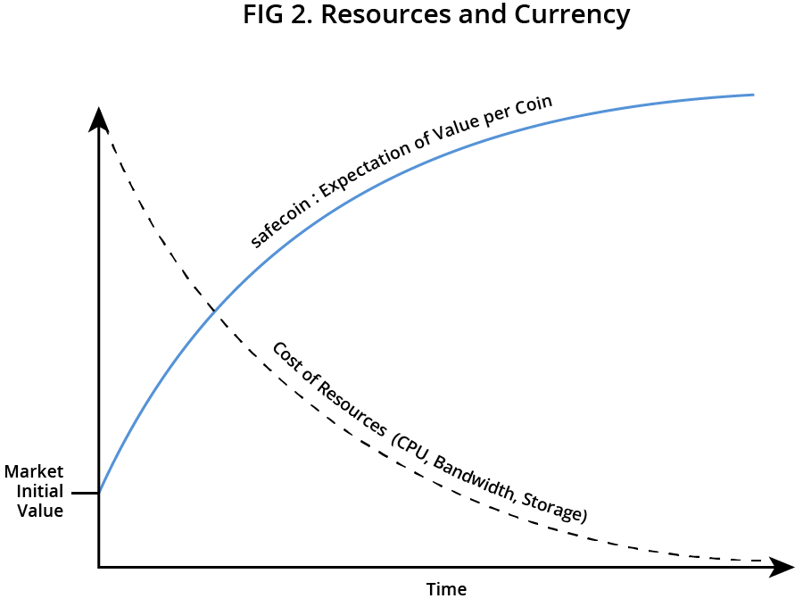
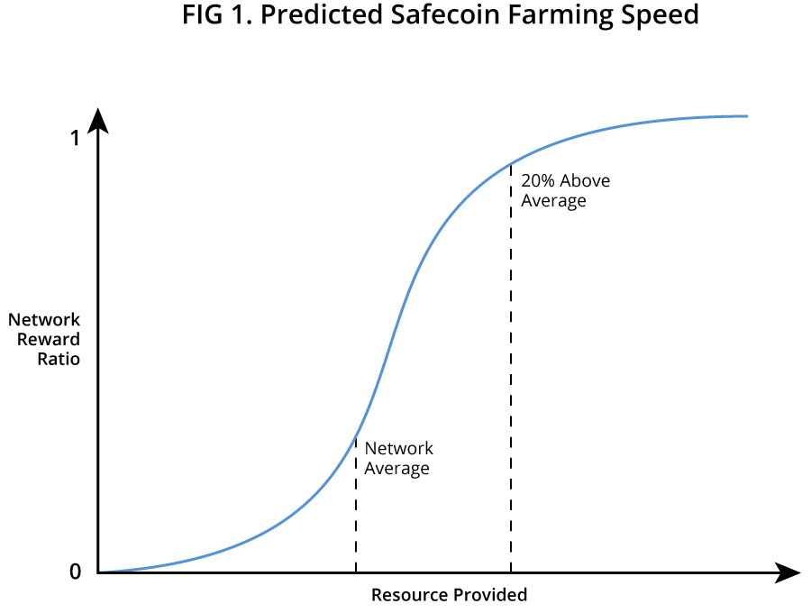
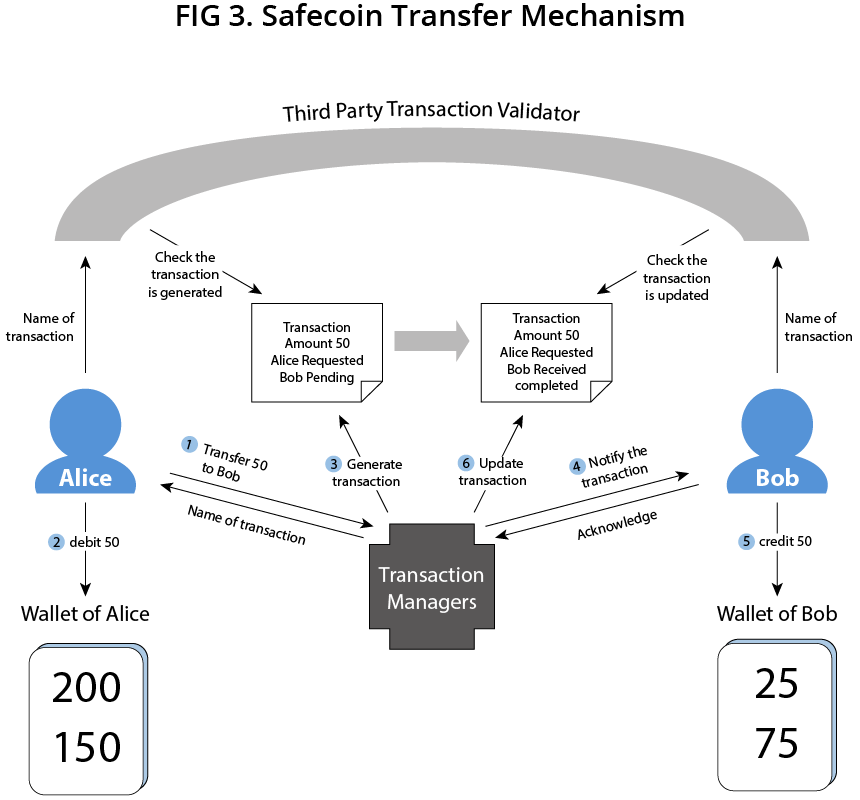

#Safecoins

Safecoins can be earned, traded or purchased. The value of safecoins will be determined by market, through the combination of supply and demand.

## Market price
The number of safecoins in circulation will increase based on network use. Almost all early safecoin holders will be farmers with this supply of resource creating both liquidity
and distribution of wealth. It is anticipated that almost all users will possess at least a few safecoins in their wallet.

Users may trade their safecoin for services on the network, or for cash (or another digital currency) using an exchange.
The ratio of safecoin being saved (left in new wallets) versus the ratio being issued to Farmers will produce a price point. This point will be the market value of safecoin

## Resources and currency

Safecoins are used to access services on the SAFE Network. This encourages constant reuse which results in increasing demand for a finite resource. As a result, the value of the safecoins increases over time. While the coins themselves increase in value, the amount of network services (resources) they buy also increases. This is shown in figure 2.

## Farming rates

Farming is a process whereby users provide resource
(storage space, CPU and bandwidth) to the network.

As figure 1 demonstrates, the safecoin earning algorithm is based on a Sigmoid curve,
in that all vaults earn, slowly at first and the rate
increases as the farmer stores up to the network
average. The earning rate also takes into account
the rank of the vault, a process whereby the network
scores the usefulness of each node from 0
(being the worst) to 1 (the best). The safecoin
farming rate is ultimately the result of the network
rate, a balance of the demand and supply
on the network, multiplied by the vault rank.
The network rate will start to level at 20% above
average, thus discouraging massive vaults which
would bring centralisation to the network’s farming
process. Safecoin is allocated to them by the
network and is paid to the successful node as
data is retrieved from it (GETS), as opposed to
when it is stored (PUTS).

The network automatically increases farming
rewards as space is required and reduces them
as space becomes abundant. Data is evenly distributed on the network and therefore farmers
looking to maximise their earnings may do so
by running several average performance nodes
rather than one high specification node.

## Safecoin transfer mechanism
Unlike bitcoin, the SAFE Network does not use
a blockchain to manage ownership of coins. Conversely,
the SAFE Network’s Transaction Managers
are unchained, meaning that only the past
and current coin owner is known. It is helpful to
think of safecoin as digital cash in this respect.

One of the major problems any virtual currency
or coin must overcome is the ability
to avoid double spending. Within the SAFE
Network, transfer of data, safecoin included,
is atomic, using a cryptographic signature to
transfer ownership.

Safecoin, the currency of the SAFE network, is generated in response to network use. As data is stored, or as apps are created and used, the network generates safecoins, each with their own  unique ID. As these coins are divisible, each new denomination is allocated a new and completely unique ID.

As the coins are allocated to users by the network, only that specific user can transfer ownership of that coin by cryptographic signature. For illustrative purposes, when Alice pays a coin to Bob via the client, she submits a payment request. The Transaction Managers check that Alice is the current owner of the coin by retrieving her public key and confirming that it has been signed by the correct and corresponding private key. The Transaction Managers will only accept a signed message from the existing owner. This proves beyond doubt that Alice is the owner of the coin and the ownership of that specific coin is then transferred to Bob and now only Bob is able to transfer that coin to another user.This process is highlighted in figure 3.

